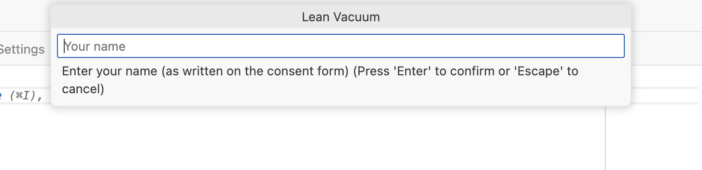
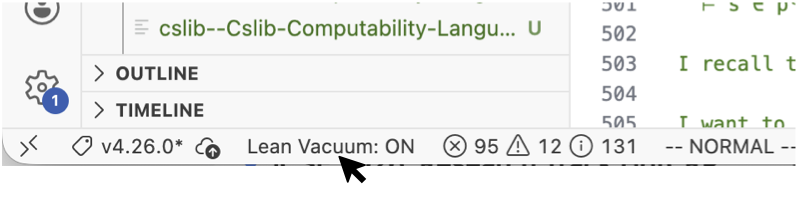

# lean-vacuum README

This extension collects fine-grained programming data while using the Lean Theorem Prover. 

For additional information or if you have trouble, please contact Kyle Thompson (r7thompson@ucsd.edu) 

## Extension Purpose
This extension exists for facilitating research on proof engineering, and to collect data that can be used
to create better tools for proof engineering. 

There is extensive data contained in version control repositories that shows the history of theorem proving projects. 
Unfortunately, the data in these repositories is coarse grained in the sense that they normally only capture work 
at the level of "commits".
By capturing key-stroke level programming data, we will have data that fully documents the theorem proving process. 

## Participation
Before your data can be used for research purposes, you must complete the consent form for the study. 
You can complete the consent form [here](https://docs.google.com/forms/d/e/1FAIpQLSfkzrajoQ7KY7BnlP96nrHPpv0r2zAk80SNunL4p-l_saKKQg/viewform?usp=header).

## Usage
Using the `lean-vacuum` extension is simple. Once you have completed the consent form and installed the extension, it will prompt
you to enter the same name you entered on the consent form. This is so that we can ensure we are only using the data from
people who have provided consent. 

After, installing the extension and entering your name, the extension will begin collecting the edits
you make on `*.lean` files. It will store these edits in a local `.changes` directory and, at regular intervals, upload 
them to a secure cloud repository.
Since the changes are uploaded to the cloud at regular intervals, **it is always safe to delete these directories**.  

For your convenience, the extension will prompt you to create a global `.gitignore_global` file to ignore this directory across your file system. 

### Enabling/Disabling `lean-vacuum`
You can very easily enable/disable the extension by clicking on the "Lean Vacuum: ON/OFF" status bar item in the lower left-hand
corner of your editor.

## Risks
**Inclusion of Sensitive Information**: If you type sensitive information into a source code file while programming, and the sensitive information isn't flagged by our secret scanners (namely GitLeaks and Microsoft Presidio), the sensitive information could end up in our dataset.
Lack of Anonymity: Because the study seeks to relate edits and the GitHub commits they are a part of, and because we wish to be able to delete your data at any time, we will store information about the GitHub user that made the edit, and the repository to which the edit belongs, which means that your data will not be stored anonymously.

**Leakage of Sensitive Information through Derived Artifacts**: Your data will be used to develop tools likely including language models. These tools can sometimes leak information from their training data which will include your edits. Therefore, it is possible, though unlikely, that you will type sensitive information in a source file, the information will go undetected by our secret scanners, be used to train a model, and the model will memorize the sensitive data and leak it t an unauthorized party.

**Leakage of Sensitive Information through Security Breaches**: Though unlikely, there is always a risk that your data will be leaked while in transit, at rest, or while in use by researchers. We will ensure that your data is encrypted while in transit, and will make sure that it is encrypted at rest. Your data will be stored in an AWS S3 bucket where only authorized researchers will have access. It is strictly prohibited for researchers to share your data, and they may only make copies of the dataset for active research. Once research activities have terminated, they must delete any copies of the dataset so that the access-controlled version in the cloud is the only persistent version of the dataset.

**Possible Unknown Risks**: In addition, there might be risks that we cannot predict at this time. These unknown risks may be temporary, mild, and last only while you are actively participating in the research, or they may be serious, long-lasting, and may even cause death. You will be informed of any new findings that might affect your health or welfare, or might affect your willingness to continue in the research.

## Reporting Problems
If you encounter a problem with the extension, please do not hesitate to reach out to Kyle Thompson at
`r7thompson@ucsd.edu`.

